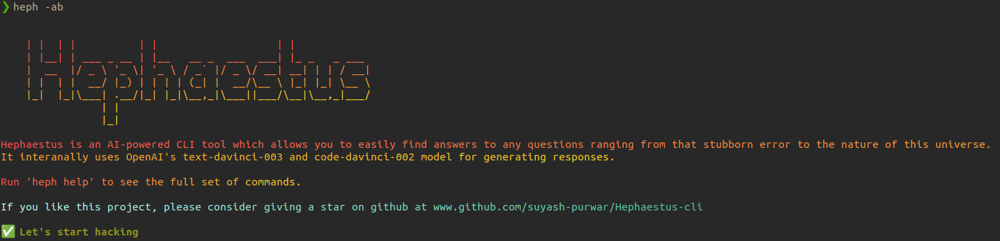
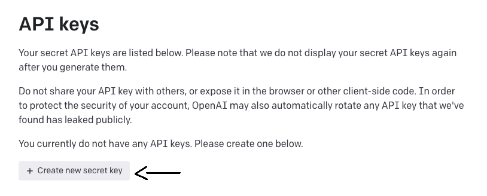
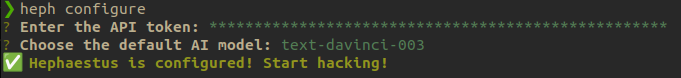

# Hephaestus CLI - An AI-Powered CLI tool for Developers




Hephaestus is an AI powered tool made for developers which helps in answering any question ranging from how to create a react app to whether we are in matrix or not right from your terminal. No need to switch to browser and scroll through hundreds of answers.

Hephaestus CLI relies uses OpenAI's `text-davinci-03` and `code-davinci-02` AI model for answering general and code related queries.

## How to install and setup

Install node.js if not present in your system. Run the following command to install the CLI globally.
```
npm i @ashnov/hephaestus-cli -g
```

Once it is installed, run `heph -v`. Response should see something like this if installation is successful.

```
Version: 0.2.1
```
Before proceeding to the CLI configuration process, go to [OpenAI Signup](https://www.platform.openai.com/signup) page and create your account. Once that's done, go to [OpenAI API Keys](https://www.platform.openai.com/account/api-keys) page to get your API keys.


Click on `Create new secret key` to create a secret key. Copy the newly generated key.

> We recommend to save this secret somewhere safely as you wouldn't be able to view it again.

Now that we have the secret key, let's move to the CLI configuration process. The CLI must be configured before starting to use it. Run `heph configure` to initiate the configuration process. Response should look something like this. Paste the secret key here and press enter.

```
? Enter the API token: 
```

After submitting the secret key, next field will show up and should look something like this.

```
? Choose the default AI model: (Use arrow keys)
❯ code-davinci-002 (best for coders) 
  text-davinci-003 
```

The next step is to choose your default AI model. If you're somebody who often needs code snippets, terminal commands, etc, choose `code-davinci-02` AI model as it specially trained for code completion. If you're who often needs answers to programming questions like How to create nextjs app, go with `text-davinci-03` AI model.

Use arrow keys to choose to move up and down. Press enter to select.

If the secret key is valid, you should see something like this.



If there's any unexpected error, raise an issue [here](https://github.com/Suyash-Purwar/Hephaestus-cli/issues/new).